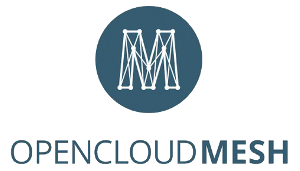

# Open Cloud Mesh Protocol Specification

This repository contains the specification of the Open Cloud Mesh protocol, including
the [OpenAPI](https://github.com/OAI/OpenAPI-Specification) (fka Swagger) specification for its API. This specification describes disovery and use of the RESTful API endpoints, request and response headers, possible response codes, request and response formats, hypermedia controls, error handling, and other API design best practices which vendors should support to make sharing of resources between different vendors possible.

* [Scope and assumptions](#scope-and-assumptions)
* [Specification](#specification)
  * [Discovery](#discovery)
  * [Share Creation](#create)
  * [Share Acceptance](#accept)
  * [Share Access](#access)
  * [Share Deletion](#unshare)
  * [Share Updating](#update)
  * [Resharing](#reshare)
  * [Invite](#invite)

* [Contributing](#contributing)

## Scope and assumptions

* For the core sharing functionality, the provider knows the consumer (both endpoint and user) when it creates a share with the consumer (also see [#26](https://github.com/cs3org/OCM-API/issues/26)). In addition, an optional invitation workflow is available in this specification (see below), which gives the consumer a way to automatically trust a provider (and vice versa). The [ScienceMesh](https://sciencemesh.io) infrastructure provides a managed white list of trusted federated sites.
* Consumer doesn't have to accept a share, the resource will be available to the consumer immediately ([#25](https://github.com/cs3org/OCM-API/issues/25)).
* Dealing with incoming shares is a vendor specific implementation. One vendor might use an 'accept before' process while another vendor might use a 'decline after' approach. This is considered part of the UX and thus not part of the interaction between different vendors. However, the consumer could notify the provider by using the introduced `/notifications` endpoint (also see [#27](https://github.com/cs3org/OCM-API/issues/27)).
* Reverting access to outgoing shares is a vendor specific implementation. One vendor might delete an entire share while another might invalidate an access token. This is considered part of vendor-specific internals and thus not part of the interaction between different vendors. However, the provider could notify the consumer by using the introduced `/notifications` endpoint (also see [#27](https://github.com/cs3org/OCM-API/issues/27)).
* The actual file sync is not part of this specification. To keep this specification 'future proof', the file sync protocol will be embedded as a separate object in Open Cloud Mesh API calls. This protocol object contains all protocol specific options, e.g. WebDAV specific options.

## Specification
### Discovery
Authentication between services is already established. This means that this specification doesn't cover the way a service authenticates incoming API calls (e.g. through an API Key, VPN connection or IP whitelisting). In this scope we assume that the services are already authenticated.

If a finite whitelist of receiver servers exists on the sender side, then this list may already contain all necessary endpoint details.

When a sending server allows sending to any internet-hosted receiving server, then discovery can happen from the sharee address, using the `/ocm-provider` well-known URL that receiving servers MAY provide according to this [specification](https://cs3org.github.io/OCM-API/docs.html?branch=develop&repo=OCM-API&user=cs3org#/paths/~1ocm-provider/get).

### Share Creation
To create a share, the sending server SHOULD make a HTTP POST request to the `/shares` endpoint of the receiving server ([docs](https://cs3org.github.io/OCM-API/docs.html?branch=develop&repo=OCM-API&user=cs3org#/paths/~1shares/post)).

### Share Acceptance
In response to a share creation, the receiving server MAY send back a [notification](https://cs3org.github.io/OCM-API/docs.html?branch=develop&repo=OCM-API&user=cs3org#/paths/~1notifications/post) to the sending server, with  `notificationType` set to `"SHARE_ACCEPTED"` or `"SHARE_DECLINED"`. The sending server MAY expose this information to the end user. 

### Share Access
To access a share, the receiving server MAY use multiple ways, depending on the received payload and on the `protocol.name` property:

* If `protocol.name` = `multi`, the receiver SHOULD make a HTTP PROPFIND request to `protocol.webdav.uri` to access the remote share. If `protocol.webdav.sharedSecret` is not empty, the receiver SHOULD pass it as a `Authorization: bearer` header.

* If `protocol.name` = `webdav`, the receiver SHOULD inspect the `protocol.options` property. If it contains a `sharedSecret`, as in the [legacy example](https://cs3org.github.io/OCM-API/docs.html?branch=develop&repo=OCM-API&user=cs3org#/paths/~1shares/post), then the receiver SHOULD make a HTTP PROPFIND request to `https://<sharedSecret>:@<host><path>`, where `<host>` is the remote server, and `<path>` is obtained by querying the [Discovery](#discovery) endpoint at the remote server and getting `resourceTypes[0].protocols.webdav`.

In both cases, when the share is a folder and the receiver accesses a resource within the share, it SHOULD append its relative path to that URL.

Additionally, if `protocol.<protocolname>.permissions` include `mfa-enabled`, the receiver MUST be ready to receive a callback to the `/mfa-enabled` endpoint ([docs](https://cs3org.github.io/OCM-API/docs.html?branch=develop&repo=OCM-API&user=cs3org#/paths/~1mfa-enabled/get)), where it SHOULD confirm that the user accessing the resource has been authenticated with MFA. This implies that the provider MUST have stored the receiver's server address, e.g. via the [Invite](#invite) flow.

### Share Deletion
A `"SHARE_ACCEPTED"` notification followed by a `"SHARE_UNSHARED"` notification is
equivalent to a `"SHARE_DECLINED"` notification.

### Share Updating
TODO: document `"RESHARE_CHANGE_PERMISSION"`

### Resharing
The `"REQUEST_RESHARE"` and `"RESHARE_UNDO"` notification types MAY be used by the
receiving server to persuarde the sending server to share the same resource with another share recipient.
TODO: document how receiver.com can know if sender.com understood and processed the
reshare request.

### Invite
If Alice (`alice at sender.com`) and Bob (`bob at receiver.com`) know each other, yet they may not have a mechanism to trust any received share request, as that may be similar to receiving spam.

In this case, Alice may invite Bob to initiate a mutual trust relationship: on the provider side, the `sender.com` service MAY implement an interface for Alice to generate a single-use token and send it to Bob off-band (e.g. via e-mail). In addition, the `sender.com` service MAY integrate this interface with [ScienceMesh](https://sciencemesh.io), and only allow a curated white list of sites as receivers.

On the receiving end, assuming that Bob wishes to accept the invitation, the receiving server MAY provide an interface for Bob to input the received token, or to interact with the ScienceMesh directory. In any case, the receiving server SHOULD make a HTTP POST request to the [/invite-accepted](https://cs3org.github.io/OCM-API/docs.html?branch=develop&repo=OCM-API&user=cs3org#/paths/~1invite-accepted/post) endpoint of the sending server, sending the token and disclosing Bob's identity details such as `bob at receiver.com`. If the token matches the one created earlier by Alice, the response MUST include Alice's identity details such as `alice at sender.com`.

Following this step, both services at `sender.com` and `receiver.com` MAY display, respectively, `bob` and `alice` as trusted or white-listed contacts, and enable sharing between them. Sites MAY enforce a policy to only accept shares between such trusted contacts, or MAY display a warning to users when a share from an unknown party is received.

For further details on this concept, see also [#54](https://github.com/cs3org/OCM-API/pull/54) and related issues. For a discussion about trust policies, see [sciencemesh#196](https://github.com/sciencemesh/sciencemesh/issues/196).

### Multi Factor Authentication
If an OCM provider exposes the capability `/mfa-enabled`, it indicates that it will try and comply with a MFA requirement set as a permission on a share. If the sharer OCM provider trusts the receiver OCM provider, the sharer MAY set the permission `mfa-enforced` on a share, which MUST be enforced according to [the endpoint's description](https://cs3org.github.io/OCM-API/docs.html?branch=develop&repo=OCM-API&user=cs3org#/paths/~1mfa-enabled/get). A compliant OCM provider that signals that it is MFA-capable MUST not allow access to a resource to a user that has not provided a second factor to establish their identity with greater confidence.

Since there is no way to guarantee that the sharee OCM provider will actually enforce the MFA requirement, it is up to the sharer OCM provider to establish a trust with the OCM sharee provider such that it is reasonable to assume that the sharee OCM provider will honor the MFA requirement. This establishment of trust will inevitably be implementation dependent, and can be done for example using a pre approved allow list of trusted OCM providers. The procedure of establishing trust is out of scope for this specification: a mechanism similar to the [ScienceMesh](https://sciencemesh.io) integration for the [Invite](#invite) capability may be envisaged.

## Changelog

[Available here](CHANGELOG.md)

## Contributing

The specification can be rendered as HTML documentation using [ReDoc](https://github.com/Redocly/redoc) and is available as follows:

* [version 1.1](https://cs3org.github.io/OCM-API/docs.html?branch=v1.1.0&repo=OCM-API&user=cs3org#/paths/~1shares/post) - current official version, supported by ScienceMesh
* [version 1.0](https://cs3org.github.io/OCM-API/docs.html?branch=v1.0.0&repo=OCM-API&user=cs3org#/paths/~1shares/post) - first official and supported version

The current developments yet to be released are available in the [develop branch](https://cs3org.github.io/OCM-API/docs.html?branch=develop&repo=OCM-API&user=cs3org)

The Open Cloud Mesh API specification is an open source, community-driven project. If you'd like to contribute, please follow the [Contributing Guidelines](CONTRIBUTING.md).

To stage the changes of your PR, you can change the repo and branch in the URL.
For instance to see the proposed changes of https://github.com/cs3org/OCM-API/pull/41, use:
[https://cs3org.github.io/OCM-API/docs.html?branch=add-endpoint-to-accept-invite&repo=OCM-API&user=LovisaLugnegard](https://cs3org.github.io/OCM-API/docs.html?branch=add-endpoint-to-accept-invite&repo=OCM-API&user=LovisaLugnegard)
