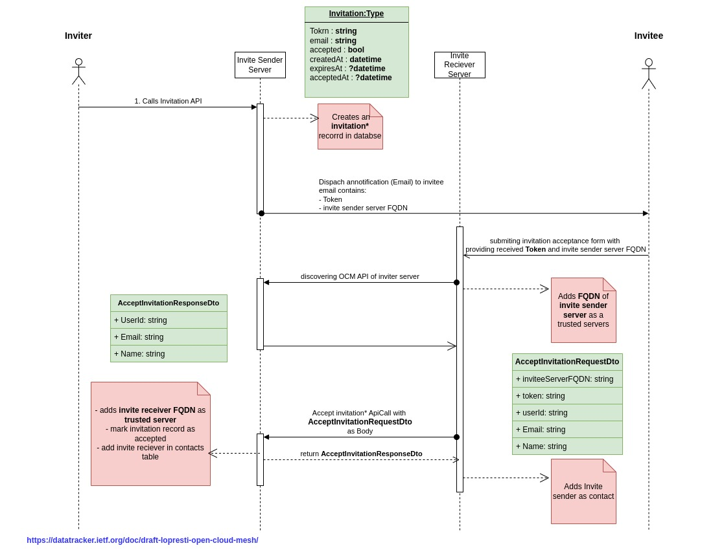

# Open Cloud Mesh Protocol Specification

This repository contains the text of the [Open Cloud Mesh IETF Draft](https://www.ietf.org/archive/id/draft-lopresti-open-cloud-mesh-00.html), as well as the equivalent [OpenAPI](https://github.com/OAI/OpenAPI-Specification) (fka Swagger) specification for its API, which can be rendered as HTML documentation using [ReDoc](https://github.com/Redocly/redoc).

The documents are available as follows:
* **Latest official version, 1.2.0**: [RFC-formatted Draft](https://github.com/cs3org/OCM-API/blob/v1.2.0/IETF-RFC.md) | [API spec](https://cs3org.github.io/OCM-API/docs.html?branch=v1.2.0&repo=OCM-API&user=cs3org)
* Development branch: [RFC-formatted Draft](IETF-RFC.md) | [API spec](https://cs3org.github.io/OCM-API/docs.html?branch=develop&repo=OCM-API&user=cs3org)

Previous versions:
* Version 1.1.0: [README](https://github.com/cs3org/OCM-API/blob/v1.1.0/README.md) | [API spec](https://cs3org.github.io/OCM-API/docs.html?branch=v1.1.0&repo=OCM-API&user=cs3org)
* Version 1.0.0: [API spec](https://cs3org.github.io/OCM-API/docs.html?branch=v1.0.0&repo=OCM-API&user=cs3org)

[SemVer](https://semver.org) versioning applies to OCM, and all versions are supported unless stated otherwise by an implementation.

## Invitation flow at a glance

 

## Contributing

The Open Cloud Mesh API specification is an open source, community-driven project. The project is hosted as a [W3C Community Group](https://www.w3.org/community/ocm/).

If you'd like to contribute, please follow the [Contributing Guidelines](CONTRIBUTING.md).

## Changelog

[Available here](CHANGELOG.md)

## Test Suite

We run [automated tests](https://github.com/pondersource/dev-stock?tab=readme-ov-file#open-cloud-mesh-test-suite-) between implementers

## Technical Workshop 2024 Recording
In Novembert 2024 we held a [technical workshop](https://indico.cern.ch/event/1451374/) about Open Cloud Mesh ([recording](https://cernbox.cern.ch/s/goxckNVnfdXLKcv )).
