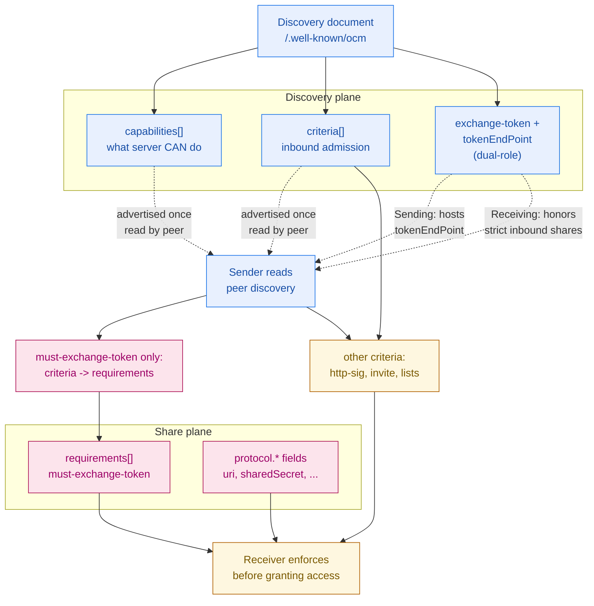

# The Four Orthogonal Planes

Informative: discovery, share, peer-interaction, enforcement planes.
Diagrams add no new normative rules; see IETF-OCM.md.

- Capabilities and criteria live in the receiver's discovery document;
  requirements and protocol shape live in each Share Creation
  Notification. See
  [OCM API Discovery](../IETF-OCM.md#ocm-api-discovery) and
  [Share Creation
  Notification](../IETF-OCM.md#share-creation-notification).
- `exchange-token` and `tokenEndPoint` describe a dual-role capability:
  the Sending Server hosts `tokenEndPoint`; the Receiving Server honors
  inbound strict shares.
- Only `must-exchange-token` binds from receiver `criteria[]` to sender
  `requirements[]`; other criteria gate admission directly.
- Enforcement of requirements and protocol fields happens at resource
  access time on the Receiving Server.
