# Receiver Discovery Publish

Informative: how a Receiving Server builds its discovery document.
Diagrams add no new normative rules; see IETF-OCM.md.

```mermaid
flowchart TD
    START["Receiver prepares<br/>discovery document"]
    START --> RF["Required fields:<br/>enabled, apiVersion,<br/>endPoint"]
    RF --> PROVIDER["OPTIONAL provider<br/>branding name"]
    PROVIDER --> RT["resourceTypes[]"]
    RT --> ST["shareTypes[]<br/>per resource type"]
    ST --> PR["protocols: send keys<br/>+ -receive keys"]
    PR --> CAP["capabilities[]"]
    CAP --> CF{"exchange-token?"}
    CF -- "Yes" --> TEP["MUST advertise<br/>tokenEndPoint"]
    CF -- "No -> omit exchange-token;<br/>cannot honor strict" --> HS{"http-sig?"}
    TEP --> HS
    HS -- "Yes" --> JWKS["JWKS at<br/>/.well-known/jwks.json"]
    HS -- "No -> omit http-sig" --> INV{"invites?"}
    JWKS --> INV
    INV -- "Yes" --> IAD["SHOULD add<br/>inviteAcceptDialog"]
    INV -- "No -> omit invites" --> NOT{"notifications?"}
    IAD --> NOT
    NOT -- "Yes" --> CRI["criteria[]"]
    NOT -- "No -> omit notifications" --> CRI
    CRI --> MET{"must-exchange-token?"}
    MET -- "Yes" --> METY["MUST also have<br/>exchange-token"]
    MET -- "No -> omit must-exchange-token<br/>from criteria; strict OK<br/>share-by-share" --> HSIG{"must-use-http-sig?"}
    METY --> HSIG
    HSIG -- "Yes" --> MINV{"must-invite?"}
    HSIG -- "No -> omit must-use-http-sig" --> MINV
    MINV -- "Yes" --> AD{"allowlist or<br/>denylist?"}
    MINV -- "No -> omit must-invite" --> AD
    AD -- "Yes" --> PUB["Publish GET<br/>/.well-known/ocm"]
    AD -- "No -> omit list criteria" --> PUB

    classDef disc fill:#e8f0fe,stroke:#1a73e8,color:#174ea6
    classDef gate fill:#fef7e0,stroke:#b06000,color:#7a5900
    classDef ok fill:#e6f4ea,stroke:#188038,color:#0d652d
    classDef fail fill:#fce8e6,stroke:#d93025,color:#a50e0e
    classDef term fill:#f7d4d0,stroke:#d93025,color:#a50e0e
    classDef neutral fill:#f1f3f4,stroke:#5f6368,color:#3c4043
    classDef share fill:#fce4ec,stroke:#ad1457,color:#9c0066
    classDef sign fill:#e0f7fa,stroke:#00838f,color:#006064
    classDef verify fill:#e8eaf6,stroke:#3949ab,color:#1a237e

    class START,RF,PROVIDER,RT,ST,PR,CAP,TEP,JWKS,IAD,CRI,PUB disc
    class CF,HS,INV,NOT,MET,HSIG,MINV,AD gate
    class METY ok
```

- Required discovery fields and `resourceTypes[]` structure are
  defined in [OCM API Discovery](../IETF-OCM.md#ocm-api-discovery).
- `exchange-token` and `tokenEndPoint` MUST be paired when advertised;
  without them the server cannot honor inbound strict shares.
- Other capabilities (`http-sig`, `invites`, `notifications`) are
  omitted from the document when unsupported.
- `must-exchange-token` in `criteria[]` requires `exchange-token`; when
  omitted, inbound strict shares MAY still be accepted share-by-share.
- Criteria such as `must-use-http-sig`, `must-invite`, and
  allowlist/denylist gate admission directly at receive time.
