# Consuming a Peer Discovery Document

Informative: Sending Server preflight before Share Creation.
Diagrams add no new normative rules; see IETF-OCM.md.

```mermaid
flowchart TD
    START["Sending Server<br/>about to create share"]
    START --> WA{"share includes<br/>protocol.webapp?"}
    WA -- "Yes" --> WAY{"sender exposes<br/>exchange-token AND<br/>tokenEndPoint?"}
    WA -- "No" --> FETCH["GET /.well-known/ocm<br/>on receiver FQDN"]
    WAY -- "Yes" --> FETCH
    WAY -- "No -> omit webapp<br/>from share" --> WOMIT["webapp omitted<br/>(continue preflight)"]
    WOMIT --> FETCH

    FETCH --> DOC["Parse discovery doc"]
    DOC --> C["capabilities[]"]
    C --> CCHK{"peer advertises<br/>exchange-token AND<br/>tokenEndPoint?"}
    CCHK -- "Yes: peer supports<br/>code flow" --> CR["criteria[]"]
    CCHK -- "No: lacks exchange-token<br/>or tokenEndPoint" --> CR

    CR --> CRCHK{"must-exchange-token<br/>in criteria[]?"}
    CRCHK -- "Yes" --> BIND["MUST include<br/>must-exchange-token<br/>in requirements[]"]
    CRCHK -- "No" --> VOL{"sender policy<br/>for this share?"}
    VOL -- "Legacy" --> OMIT["omit<br/>must-exchange-token"]
    VOL -- "Strict" --> PEER{"peer exposes<br/>exchange-token?"}
    PEER -- "Yes" --> VOLIN["voluntarily include<br/>must-exchange-token"]
    PEER -- "No -> omit<br/>must-exchange-token" --> OMIT

    BIND --> SENDCHK{"sender exposes<br/>exchange-token AND<br/>tokenEndPoint?"}
    VOLIN --> SENDCHK
    OMIT --> RT["resourceTypes[]"]

    SENDCHK -- "Yes" --> RT
    SENDCHK -- "No" --> STOP["MUST NOT create share"]

    RT --> RTCHK{"receiver supports<br/>resourceType + shareType<br/>+ protocol?"}
    RTCHK -- "Yes" --> BUILD["build Share Creation<br/>Notification"]
    RTCHK -- "No" --> STOPRT["SHOULD NOT create share"]

    BUILD --> SEND["POST /shares<br/>(sign if http-sig)"]

    classDef disc fill:#e8f0fe,stroke:#1a73e8,color:#174ea6
    classDef gate fill:#fef7e0,stroke:#b06000,color:#7a5900
    classDef ok fill:#e6f4ea,stroke:#188038,color:#0d652d
    classDef fail fill:#fce8e6,stroke:#d93025,color:#a50e0e
    classDef term fill:#f7d4d0,stroke:#d93025,color:#a50e0e
    classDef neutral fill:#f1f3f4,stroke:#5f6368,color:#3c4043
    classDef share fill:#fce4ec,stroke:#ad1457,color:#9c0066
    classDef sign fill:#e0f7fa,stroke:#00838f,color:#006064
    classDef verify fill:#e8eaf6,stroke:#3949ab,color:#1a237e

    class START,FETCH,DOC,C,CR,RT disc
    class WA,WAY,CCHK,CRCHK,VOL,PEER,SENDCHK,RTCHK gate
    class BIND,VOLIN,BUILD,SEND share
    class STOP,STOPRT fail
    class WOMIT,OMIT neutral
```

- WebApp-first: when a share includes `protocol.webapp`, the sender MUST
  expose `exchange-token` and `tokenEndPoint` or omit webapp from the
  offer. See [Share Creation
  Notification](../IETF-OCM.md#share-creation-notification).
- `capabilities[]`: what the peer can do; `criteria[]`: what the peer
  demands of inbound shares. See [OCM API
  Discovery](../IETF-OCM.md#ocm-api-discovery).
- On voluntary strict policy, omit `must-exchange-token` when the peer
  lacks `exchange-token`; do not fail preflight.
- Before including `must-exchange-token` in `requirements[]`, the sender
  itself MUST expose `exchange-token` and `tokenEndPoint`.
- `resourceTypes[]` is the final preflight gate; `file` + `user` +
  `webdav` is the interoperable baseline.
