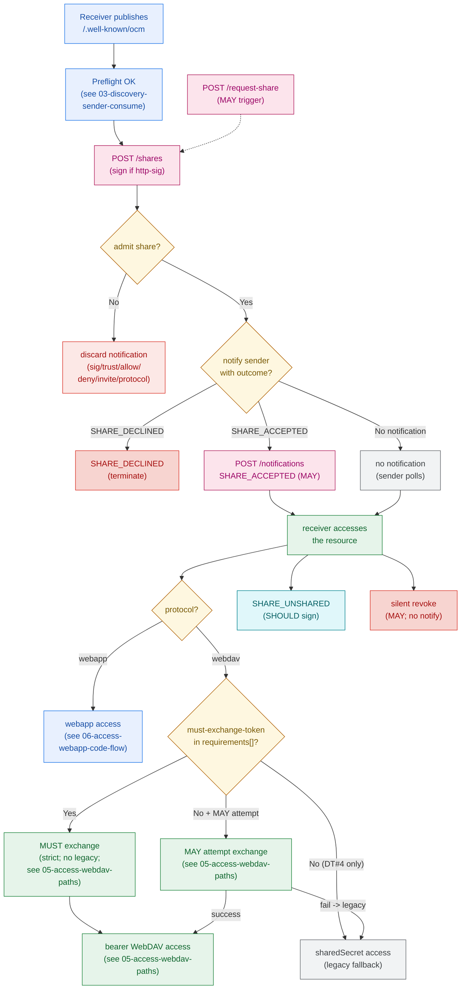

# Share Lifecycle

Informative: end-to-end share interaction across the four planes.
Diagrams add no new normative rules; see IETF-OCM.md.

- Discovery publish and sender preflight are detailed in
  [02-discovery-receiver-publish.md](02-discovery-receiver-publish.md)
  and [03-discovery-sender-consume.md](03-discovery-sender-consume.md).
- Discard reasons follow [Decision to
  Discard](../IETF-OCM.md#decision-to-discard) (signature, trust/JWKS,
  allow/deny lists, invite trust, protocol/resource checks).
- Share Acceptance Notification is MAY; see [Share Acceptance
  Notification](../IETF-OCM.md#share-acceptance-notification).
- WebDAV access paths preserve legacy fallback on DT#4-only shares
  and on failed optional exchange; see
  [05-access-webdav-paths.md](05-access-webdav-paths.md).
- Post-access updates: `SHARE_UNSHARED` SHOULD be signed; silent revoke
  MAY omit notification. See [General
  Flow](../IETF-OCM.md#general-flow).
