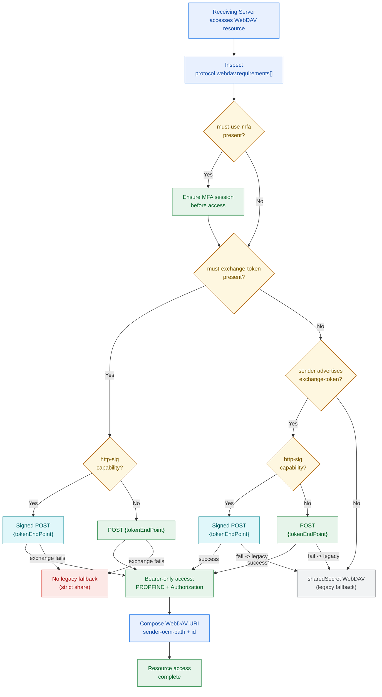

# WebDAV Resource Access Paths

Informative: WebDAV access decisions on the Receiving Server.
Diagrams add no new normative rules; see IETF-OCM.md.

- WebDAV URI composition uses the sender's
  `resourceTypes[0].protocols.webdav` (`<sender-ocm-path>`, from the
  sender's discovery queried at the share `sender` FQDN) plus the
  share's `protocol.webdav.uri` as `<id>` when it is not a complete
  URI; PROPFIND targets `https://<sender-host><sender-ocm-path>/<id>`.
- When `must-exchange-token` is in `requirements[]`, the receiver MUST
  exchange via `{tokenEndPoint}` and MUST NOT fall back to
  `sharedSecret` (strict arm; see 03-discovery-sender-consume.md).
- When the requirement is absent but the sender advertises
  `exchange-token`, the receiver MAY attempt exchange and MAY fall back
  to `sharedSecret` on failure.
- `must-use-mfa` in requirements triggers MFA enforcement before access.
- Signed POST to `{tokenEndPoint}` applies when the sender advertises
  `http-sig`; see [Code Flow](../IETF-OCM.md#code-flow).
