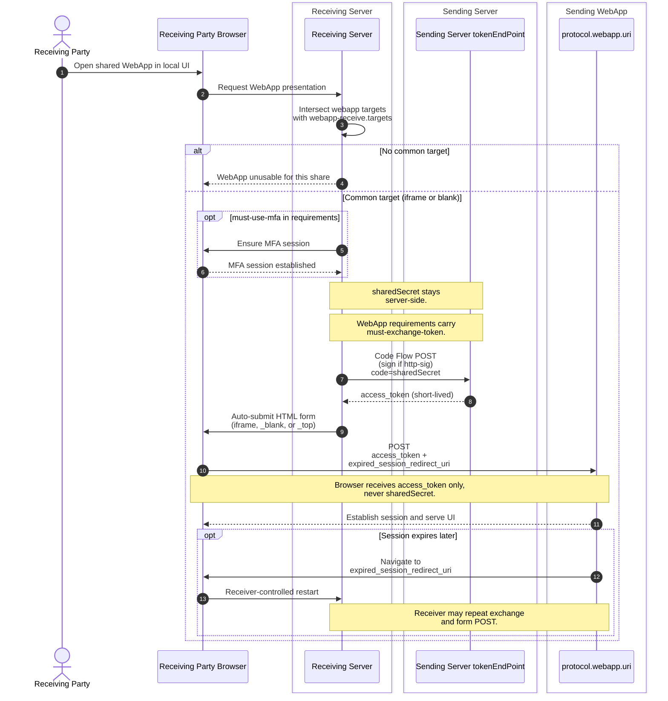

# WebApp Code Flow Access

Informative: Receiving Server presents a shared WebApp to the user.
Diagrams add no new normative rules; see IETF-OCM.md.

- WebApp shares MUST use the Code Flow; `protocol.webapp.requirements[]`
  always includes `must-exchange-token`. See [Code
  Flow](../IETF-OCM.md#code-flow).
- The Receiving Server POSTs `sharedSecret` to the sender's
  `tokenEndPoint`; signing applies when the sender
  advertises `http-sig`.
- Presentation targets come from intersecting `protocol.webapp.targets`
  with `webapp-receive.targets` in discovery.
- On session expiry the Sending WebApp navigates to
  `expired_session_redirect_uri` (normative field); the receiver may
  repeat exchange and form POST.
- See also [05-access-webdav-paths.md](05-access-webdav-paths.md) for
  WebDAV access and [07-signing-directions.md](07-signing-directions.md)
  for signing on `{tokenEndPoint}`.
