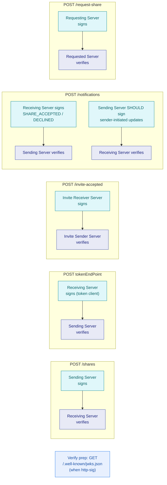

# Signing Directions

Informative visual companion to the Signing Direction Index in the
IETF draft. Diagrams add no new normative rules; see IETF-OCM.md.

- Companion to [Signing Direction
  Index](../IETF-OCM.md#signing-direction-index) and [HTTP Message
  Signatures](../IETF-OCM.md#http-message-signatures).
- Signing applies when the peer advertises `http-sig`;
  `must-use-http-sig` makes verification mandatory on inbound
  requests.
- `/notifications` carries traffic in both directions; signing follows
  the notification actor, not the endpoint name.
- The Code Flow token request is signed by the Receiving Server (token
  client) and verified by the Sending Server.
- Verifiers SHOULD fetch JWKS from `/.well-known/jwks.json` when
  `http-sig` is advertised.
