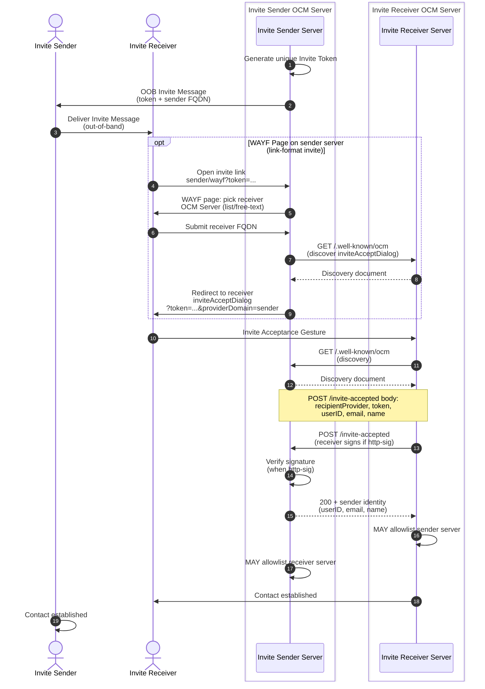

# Invite Flow

Informative: establishing contact before share creation.
Diagrams add no new normative rules; see IETF-OCM.md.

- Steps follow [Invite Flow](../IETF-OCM.md#invite-flow) and
  [Establishing Contact](../IETF-OCM.md#establishing-contact).
- When the invite uses the link format, the Invite Sender's WAYF page
  discovers the Invite Receiver OCM Server's `inviteAcceptDialog` via OCM
  API Discovery (`GET /.well-known/ocm` on the receiver FQDN) and
  redirects the Invite Receiver there with `token` and `providerDomain`
  query parameters. The `invite-wayf` capability and `inviteAcceptDialog`
  field are advertised in discovery; see [Invite
  format](../IETF-OCM.md#invite-format) and [OCM API
  Discovery](../IETF-OCM.md#ocm-api-discovery). The WAYF server list MAY
  be populated from a Directory Service.
- The Invite Acceptance Request is a signed POST to `/invite-accepted`
  on the Invite Sender OCM Server; see [Invite Acceptance Request
  Details](../IETF-OCM.md#invite-acceptance-request-details).
- Both servers MAY allowlist each other and add the remote party as a
  contact; see [Addition into address
  books](../IETF-OCM.md#addition-into-address-books).
- Invites are orthogonal to share lifecycle; see
  [04-share-lifecycle.md](04-share-lifecycle.md).
