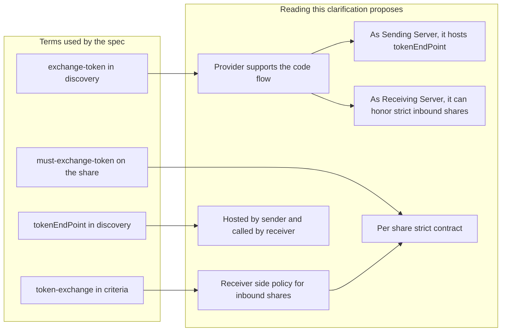

```mermaid
flowchart LR
    subgraph A["Terms used by the spec"]
        A1["exchange-token in discovery"]
        A2["token-exchange in criteria"]
        A3["must-exchange-token on the share"]
        A4["tokenEndPoint in discovery"]
    end

    subgraph B["Reading this clarification proposes"]
        B1["Provider supports the code flow"]
        B2["As Sending Server, it hosts tokenEndPoint"]
        B3["As Receiving Server, it can honor strict inbound shares"]
        B4["Receiver side policy for inbound shares"]
        B5["Per share strict contract"]
        B6["Hosted by sender and called by receiver"]
    end

    A1 --> B1
    B1 --> B2
    B1 --> B3
    A2 --> B4
    A3 --> B5
    A4 --> B6
    B4 --> B5
```
