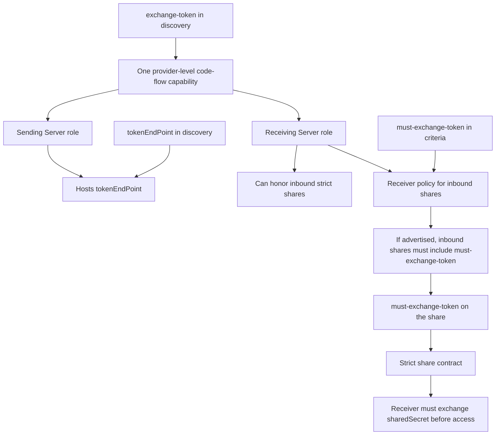

```mermaid
flowchart TD
    ET["exchange-token in discovery"]
    TX["must-exchange-token in criteria"]
    EP["tokenEndPoint in discovery"]
    MS["must-exchange-token on the share"]

    ET --> P["One provider-level code-flow capability"]
    P --> S["Sending Server role"]
    P --> R["Receiving Server role"]

    S --> S1["Hosts tokenEndPoint"]
    EP --> S1

    R --> R1["Can honor inbound strict shares"]
    R --> R2["Receiver policy for inbound shares"]
    TX --> R2
    R2 --> R3["If advertised, inbound shares must include must-exchange-token"]
    R3 --> MS

    MS --> M1["Strict share contract"]
    M1 --> M2["Receiver must exchange sharedSecret before access"]
```
