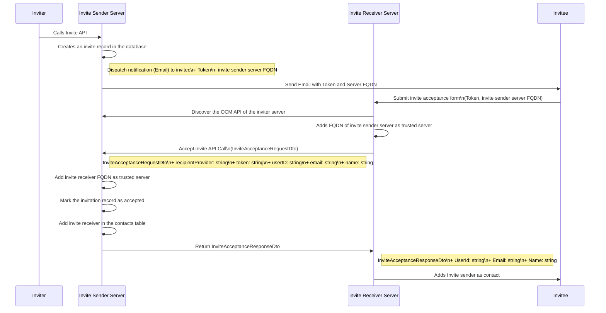

```mermaid
sequenceDiagram
    participant Inviter
    participant InviteSenderServer as Invite Sender Server
    participant InviteReceiverServer as Invite Receiver Server
    participant Invitee

    Inviter->>InviteSenderServer: Calls Invite API
    InviteSenderServer->>InviteSenderServer: Creates an invite record in the database
    Note right of InviteSenderServer: Dispatch notification (Email) to invitee\n- Token\n- invite sender server FQDN

    InviteSenderServer->>Invitee: Send Email with Token and Server FQDN
    Invitee->>InviteReceiverServer: Submit invite acceptance form\n(Token, invite sender server FQDN)
    
    InviteReceiverServer->>InviteSenderServer: Discover the OCM API of the inviter server
    InviteReceiverServer->>InviteReceiverServer: Adds FQDN of invite sender server as trusted server

    InviteReceiverServer->>InviteSenderServer: Accept invite API Call\n(InviteAcceptanceRequestDto)
    Note left of InviteReceiverServer: InviteAcceptanceRequestDto\n+ recipientProvider: string\n+ token: string\n+ userID: string\n+ email: string\n+ name: string

    InviteSenderServer->>InviteSenderServer: Add invite receiver FQDN as trusted server
    InviteSenderServer->>InviteSenderServer: Mark the invitation record as accepted
    InviteSenderServer->>InviteSenderServer: Add invite receiver in the contacts table
    InviteSenderServer->>InviteReceiverServer: Return InviteAcceptanceResponseDto
    
    Note right of InviteReceiverServer: InviteAcceptanceResponseDto\n+ UserId: string\n+ Email: string\n+ Name: string
    InviteReceiverServer->>Invitee: Adds Invite sender as contact
```
