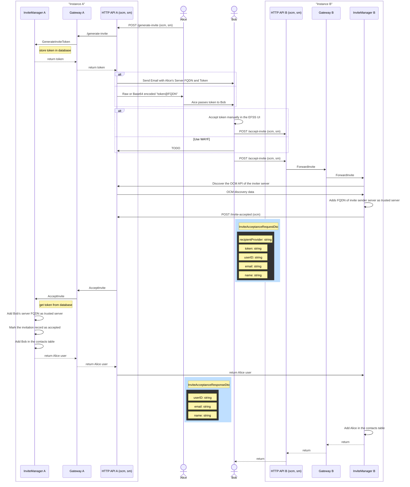

```mermaid
sequenceDiagram

    %% Instance A components
    box "Instance A" #0f2749
        participant InviteManagerA as InviteManager A
        participant GatewayA as Gateway A
        participant HTTPA as HTTP API A (ocm, sm)
    end

    %% OCM Invitation Flow
    %% Actors
    actor UserA as Alice
    actor UserB as Bob

    %% Instance B components
    box "Instance B" #0f2749
        participant HTTPB as HTTP API B (ocm, sm)
        participant GatewayB as Gateway B
        participant InviteManagerB as InviteManager B
    end

    %% Invitation creation
    UserA ->> HTTPA: POST /generate-invite (ocm, sm)
    HTTPA ->> GatewayA: /generate-invite
    GatewayA ->> InviteManagerA: GenerateInviteToken
    Note right of InviteManagerA: store token in database
    InviteManagerA -->> GatewayA: return token
    GatewayA -->> HTTPA: return token

    alt
        HTTPA ->> UserB: Send Email with Alice's Server FQDN and Token
    else
        HTTPA ->> UserA: Raw or Base64 encoded "token@FQDN"
        UserA ->> UserB: Aice passes token to Bob
    end

    alt 
        UserB ->> UserB: Accept token manually in the EFSS UI
        UserB ->> HTTPB: POST /accept-invite (ocm, sm)
    else Use WAYF
         UserB ->> HTTPA: TODO
    end
 
    %% Invitation acceptance on B
    UserB ->> HTTPB: POST /accept-invite (ocm, sm)
    HTTPB ->> GatewayB: ForwardInvite
    GatewayB ->> InviteManagerB: ForwardInvite
    InviteManagerB ->> HTTPA: Discover the OCM API of the inviter server
    HTTPA ->>InviteManagerB: OCM discovery data
    InviteManagerB ->> InviteManagerB: Adds FQDN of invite sender server as trusted server
    InviteManagerB ->> HTTPA: POST /invite-accepted (ocm)
    rect rgb(191, 223, 255)
        Note right of UserB: InviteAcceptanceRequestDto
        rect
            Note right of UserB: recipientProvider: string
            Note right of UserB: token: string
            Note right of UserB: userID: string
            Note right of UserB: email: string
            Note right of UserB: name: string
        end
    end

    %% Process acceptance on A
    HTTPA ->> GatewayA: AcceptInvite
    GatewayA ->> InviteManagerA: AcceptInvite
    Note right of InviteManagerA: get token from database
    InviteManagerA ->> InviteManagerA: Add Bob's server FQDN as trusted server
    InviteManagerA ->> InviteManagerA: Mark the invitation record as accepted
    InviteManagerA ->> InviteManagerA: Add Bob in the contacts table
    InviteManagerA -->> GatewayA: return Alice user
    GatewayA -->> HTTPA: return Alice user
    
    %% Propagation to B
    HTTPA ->> InviteManagerB: return Alice user
    rect rgb(191, 223, 255)
        Note right of UserA: InviteAcceptanceResponseDto
        rect
            Note right of UserA: userID: string
            Note right of UserA: email: string
            Note right of UserA: name: string
        end
    end
    InviteManagerB ->> InviteManagerB: Add Alice in the contacts table
    InviteManagerB -->> GatewayB: return
    GatewayB -->> HTTPB: return
    HTTPB -->> UserB: return

```
