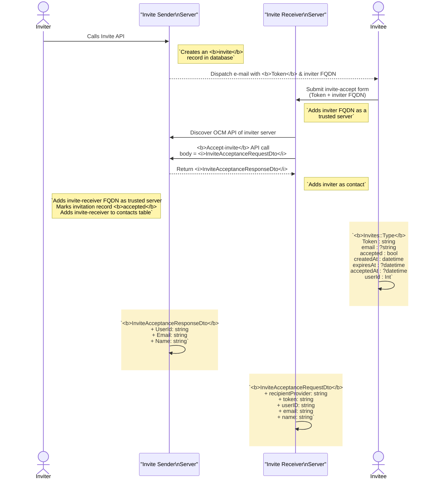

```mermaid
sequenceDiagram
    actor Inviter
    participant ISS as "Invite Sender\nServer"
    participant IRS as "Invite Receiver\nServer"
    actor Invitee

    Inviter ->> ISS: Calls Invite API

    Note right of ISS: `Creates an <b>invite</b><br/>record in database`

    ISS -->> Invitee: Dispatch e-mail with <b>Token</b> & inviter FQDN

    Invitee ->> IRS: Submit invite-accept form<br/>(Token + inviter FQDN)

    Note right of IRS: `Adds inviter FQDN as a<br/>trusted server`

    IRS ->> ISS: Discover OCM API of inviter server

    IRS ->> ISS: <b>Accept-invite</b> API call<br/>body = <i>InviteAcceptanceRequestDto</i>

    ISS -->> IRS: Return <i>InviteAcceptanceResponseDto</i>

    Note right of IRS: `Adds inviter as contact`

    Note left of ISS: `Adds invite-receiver FQDN as trusted server<br/>Marks invitation record <b>accepted</b><br/>Adds invite-receiver to contacts table`

    rect rgba(237, 192, 1, 0.2)
      Invitee ->> Invitee: `<b>Invites::Type</b><br/>Token : string<br/>email : ?string<br/>accepted : bool<br/>createdAt : datetime<br/>expiresAt : ?datetime<br/>acceptedAt : ?datetime<br/>userId : Int`
    end

    rect rgba(237, 192, 1, 0.2)
      ISS ->> ISS: `<b>InviteAcceptanceResponseDto</b><br/>+ UserId: string<br/>+ Email: string<br/>+ Name: string`
    end

    rect rgba(237, 192, 1, 0.2)
      IRS ->> IRS: `<b>InviteAcceptanceRequestDto</b><br/>+ recipientProvider: string<br/>+ token: string<br/>+ userID: string<br/>+ email: string<br/>+ name: string`
    end
```
