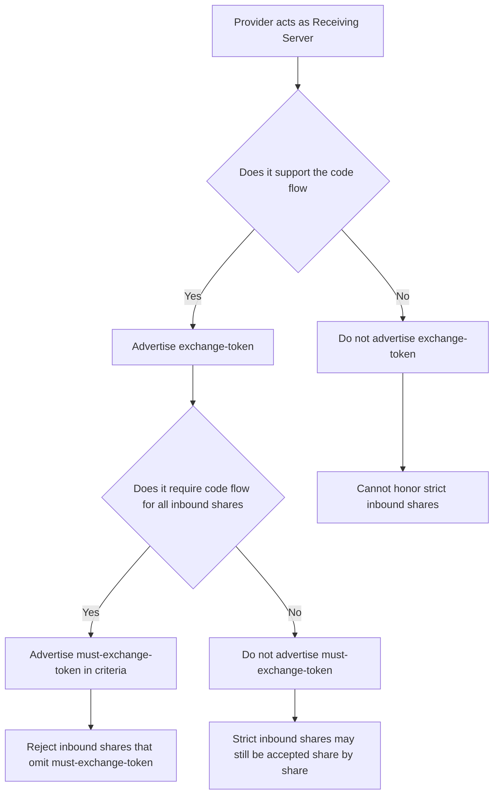

```mermaid
flowchart TD
    A["Provider acts as Receiving Server"]
    A --> B{"Does it support the code flow"}

    B -- "Yes" --> C["Advertise exchange-token"]
    C --> D{"Does it require code flow for all inbound shares"}
    D -- "Yes" --> E["Advertise must-exchange-token in criteria"]
    E --> F["Reject inbound shares that omit must-exchange-token"]
    D -- "No" --> G["Do not advertise must-exchange-token"]
    G --> H["Strict inbound shares may still be accepted share by share"]

    B -- "No" --> I["Do not advertise exchange-token"]
    I --> J["Cannot honor strict inbound shares"]
```
