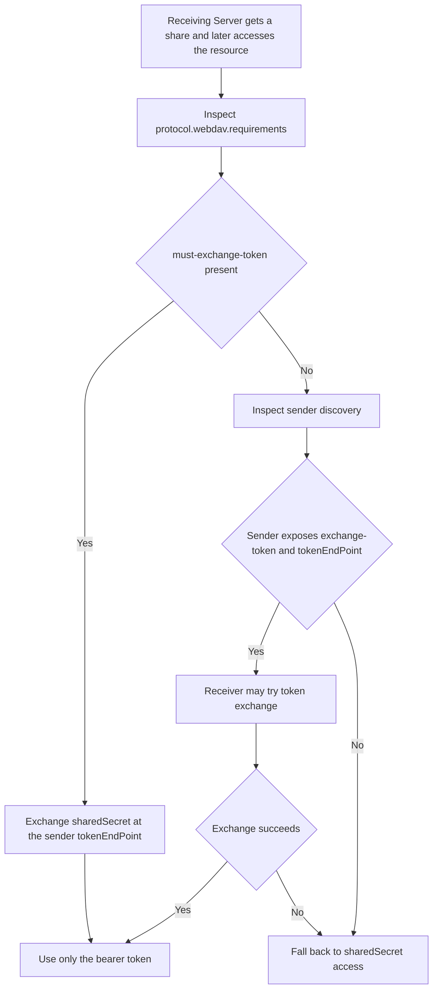

```mermaid
flowchart TD
    A["Receiving Server gets a share and later accesses the resource"]
    A --> B["Inspect protocol.webdav.requirements"]
    B --> C{"must-exchange-token present"}

    C -- "Yes" --> D["Exchange sharedSecret at the sender tokenEndPoint"]
    D --> E["Use only the bearer token"]

    C -- "No" --> F["Inspect sender discovery"]
    F --> G{"Sender exposes exchange-token and tokenEndPoint"}
    G -- "Yes" --> H["Receiver may try token exchange"]
    H --> I{"Exchange succeeds"}
    I -- "Yes" --> E
    I -- "No" --> J["Fall back to sharedSecret access"]
    G -- "No" --> J
```
