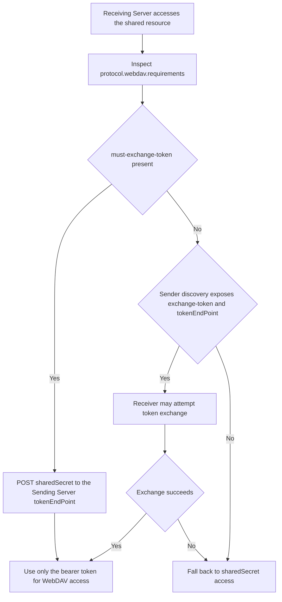

```mermaid
flowchart TD
    A["Receiving Server accesses the shared resource"]
    A --> B["Inspect protocol.webdav.requirements"]
    B --> C{"must-exchange-token present"}

    C -- "Yes" --> D["POST sharedSecret to the Sending Server tokenEndPoint"]
    D --> E["Use only the bearer token for WebDAV access"]

    C -- "No" --> F{"Sender discovery exposes exchange-token and tokenEndPoint"}
    F -- "Yes" --> G["Receiver may attempt token exchange"]
    G --> H{"Exchange succeeds"}
    H -- "Yes" --> E
    H -- "No" --> I["Fall back to sharedSecret access"]
    F -- "No" --> I
```
