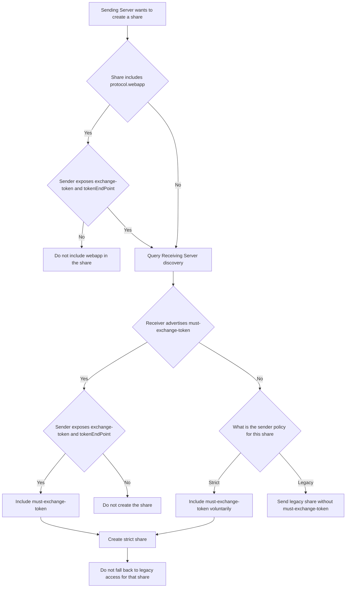

```mermaid
flowchart TD
    A["Sending Server wants to create a share"]
    A --> W{"Share includes protocol.webapp"}
    W -- "Yes" --> X{"Sender exposes exchange-token and tokenEndPoint"}
    X -- "No" --> Y["Do not include webapp in the share"]
    X -- "Yes" --> B["Query Receiving Server discovery"]
    W -- "No" --> B
    B --> C{"Receiver advertises must-exchange-token"}

    C -- "Yes" --> D{"Sender exposes exchange-token and tokenEndPoint"}
    D -- "Yes" --> E["Include must-exchange-token"]
    E --> F["Create strict share"]
    F --> G["Do not fall back to legacy access for that share"]
    D -- "No" --> H["Do not create the share"]

    C -- "No" --> I{"What is the sender policy for this share"}
    I -- "Strict" --> J["Include must-exchange-token voluntarily"]
    J --> F
    I -- "Legacy" --> K["Send legacy share without must-exchange-token"]
```
