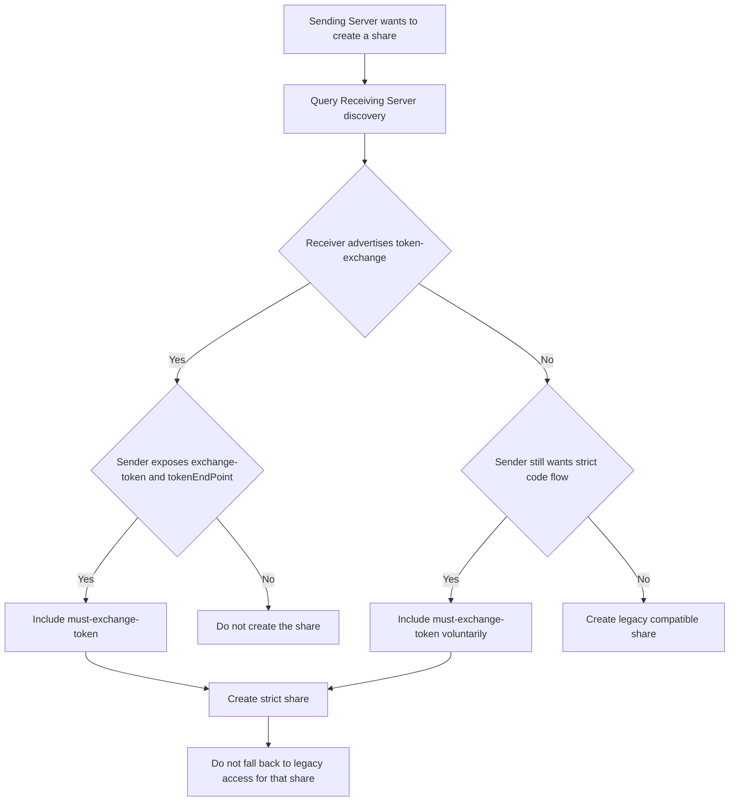

```mermaid
flowchart TD
    A["Sending Server wants to create a share"]
    A --> B["Query Receiving Server discovery"]
    B --> C{"Receiver advertises token-exchange"}

    C -- "Yes" --> D{"Sender exposes exchange-token and tokenEndPoint"}
    D -- "Yes" --> E["Include must-exchange-token"]
    E --> F["Create strict share"]
    F --> G["Do not fall back to legacy access for that share"]
    D -- "No" --> H["Do not create the share"]

    C -- "No" --> I{"Sender still wants strict code flow"}
    I -- "Yes" --> J["Include must-exchange-token voluntarily"]
    J --> F
    I -- "No" --> K["Create legacy compatible share"]
```
