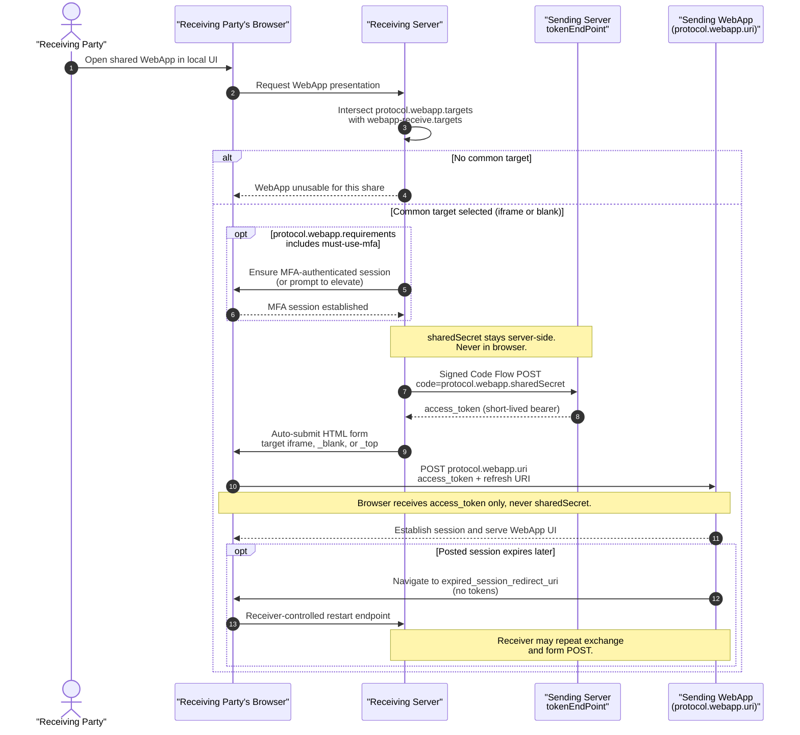

# WebApp Resource Access

```mermaid
sequenceDiagram
    autonumber
    actor RP as "Receiving Party"
    participant B as "Receiving Party's Browser"
    participant RS as "Receiving Server"
    participant TE as "Sending Server<br/>tokenEndPoint"
    participant SWA as "Sending WebApp<br/>(protocol.webapp.uri)"

    RP->>B: Open shared WebApp in local UI
    B->>RS: Request WebApp presentation

    RS->>RS: Intersect protocol.webapp.targets<br/>with webapp-receive.targets

    alt No common target
        RS-->>B: WebApp unusable for this share
    else Common target selected (iframe or blank)
        opt protocol.webapp.requirements includes must-use-mfa
            RS->>B: Ensure MFA-authenticated session<br/>(or prompt to elevate)
            B-->>RS: MFA session established
        end

        Note over RS,TE: sharedSecret stays server-side.<br/>Never in browser.

        RS->>TE: Signed Code Flow POST<br/>code=protocol.webapp.sharedSecret
        TE-->>RS: access_token (short-lived bearer)

        RS->>B: Auto-submit HTML form<br/>target iframe, _blank, or _top
        B->>SWA: POST protocol.webapp.uri<br/>access_token + refresh URI

        Note over B,SWA: Browser receives access_token only, never sharedSecret.
        SWA-->>B: Establish session and serve WebApp UI

        opt Posted session expires later
            SWA->>B: Navigate to expired_session_redirect_uri<br/>(no tokens)
            B->>RS: Receiver-controlled restart endpoint
            Note over RS,SWA: Receiver may repeat exchange<br/>and form POST.
        end
    end
```
